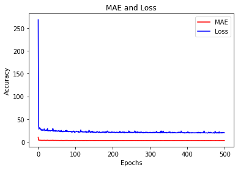

# Comparison of Mean Average Errors of different types of Models

In this blog,we compare the MAEs of different models, when we change the layers.

You can use the [.ipnyb notebook](https://github.com/cyriacbijun/Tensorflow_NLP/blob/master/MAE_models/MAE_models.ipynb) that is given with the repo by downloading and starting a kernel.


*   For local computer, use [jupyter notebook](https://jupyter.org/install)
*   For cloud usage, checkout [Google colab](https://colab.research.google.com/notebooks/intro.ipynb)


```python
import tensorflow as tf
import numpy as np
import matplotlib.pyplot as plt
```

The following cell is simply used to define functions which enables us to create synthetic series, just like the previous exercise.


```python
def plot_series(time, series, format="-", start=0, end=None):
    plt.plot(time[start:end], series[start:end], format)
    plt.xlabel("Time")
    plt.ylabel("Value")
    plt.grid(False)

def trend(time, slope=0):
    return slope * time

def seasonal_pattern(season_time):
    """Just an arbitrary pattern, you can change it if you wish"""
    return np.where(season_time < 0.1,
                    np.cos(season_time * 6 * np.pi),
                    2 / np.exp(9 * season_time))

def seasonality(time, period, amplitude=1, phase=0):
    """Repeats the same pattern at each period"""
    season_time = ((time + phase) % period) / period
    return amplitude * seasonal_pattern(season_time)

def noise(time, noise_level=1, seed=None):
    rnd = np.random.RandomState(seed)
    return rnd.randn(len(time)) * noise_level

time = np.arange(10 * 365 + 1, dtype="float32")
baseline = 10
series = trend(time, 0.1)  
baseline = 10
amplitude = 40
slope = 0.005
noise_level = 3

# Create the series
series = baseline + trend(time, slope) + seasonality(time, period=365, amplitude=amplitude)
# Update with noise
series += noise(time, noise_level, seed=51)
```

We split the series into train and validation, where the training data is upto 3000 and validation is rest of the data. Then, we plot it.


```python
split_time = 3000
time_train = time[:split_time]
x_train = series[:split_time]
time_valid = time[split_time:]
x_valid = series[split_time:]

window_size = 20
batch_size = 32
shuffle_buffer_size = 1000

plot_series(time, series)
```


As seen in the previous exercise, we can create an instance of tensorflow dataset with below code, which has inbuilt batching and shuffling.


```python
def windowed_dataset(series, window_size, batch_size, shuffle_buffer):
  dataset = tf.data.Dataset.from_tensor_slices(series)
  dataset = dataset.window(window_size + 1, shift=1, drop_remainder=True)
  dataset = dataset.flat_map(lambda window: window.batch(window_size + 1))
  dataset = dataset.shuffle(shuffle_buffer).map(lambda window: (window[:-1], window[-1]))
  dataset = dataset.batch(batch_size).prefetch(1)
  return dataset
```

Why did we use a Lambda layer? An RNN expects 3 dimensions:
* batch-size
* the number of timestamps
* series dimensionality
So, since we are providing only 2 dimensions using the dataset, we can use a Lambda Layer to increase the dimension of input Layer, to suit the RNN.

`tf.keras.backend.clear_session()` is used so that the backend is cleared and models does not affect each other. Here, you can also see `tf.keras.callbacks.LearningRateScheduler`. The function is ... as the training progresses, the learning rate is changed via the callback function depending on the current epoch. So, inintial `lr` was $10^{-8}$. The as the epoch number changes, `lr` also changes according to the formula : `1e-8 * 10**(epoch / 20)`


```python
tf.keras.backend.clear_session()
tf.random.set_seed(51)
np.random.seed(51)

tf.keras.backend.clear_session()
dataset = windowed_dataset(x_train, window_size, batch_size, shuffle_buffer_size)

model = tf.keras.models.Sequential([
  tf.keras.layers.Lambda(lambda x: tf.expand_dims(x, axis=-1),
                      input_shape=[None]),
  tf.keras.layers.Bidirectional(tf.keras.layers.LSTM(32, return_sequences=True)),
  tf.keras.layers.Bidirectional(tf.keras.layers.LSTM(32)),
  tf.keras.layers.Dense(1),
  tf.keras.layers.Lambda(lambda x: x * 10.0)
])

lr_schedule = tf.keras.callbacks.LearningRateScheduler(
    lambda epoch: 1e-8 * 10**(epoch / 20))
optimizer = tf.keras.optimizers.SGD(lr=1e-8, momentum=0.9)
model.compile(loss=tf.keras.losses.Huber(),
              optimizer=optimizer,
              metrics=["mae"])
history = model.fit(dataset, epochs=100, callbacks=[lr_schedule])
```

    Epoch 1/100
    94/94 [==============================] - 3s 29ms/step - loss: 20.4602 - mae: 20.8828 - lr: 1.0000e-08
    Epoch 2/100
    94/94 [==============================] - 3s 28ms/step - loss: 20.3766 - mae: 20.8543 - lr: 1.1220e-08
    Epoch 3/100
    94/94 [==============================] - 3s 29ms/step - loss: 20.3643 - mae: 20.8218 - lr: 1.2589e-08
    Epoch 4/100
    94/94 [==============================] - 3s 29ms/step - loss: 20.3237 - mae: 20.7851 - lr: 1.4125e-08
    Epoch 5/100
    94/94 [==============================] - 3s 28ms/step - loss: 20.2210 - mae: 20.7436 - lr: 1.5849e-08
    Epoch 6/100
    94/94 [==============================] - 3s 28ms/step - loss: 20.1817 - mae: 20.6964 - lr: 1.7783e-08
    Epoch 7/100
    94/94 [==============================] - 3s 28ms/step - loss: 20.1016 - mae: 20.6429 - lr: 1.9953e-08
    Epoch 8/100
    94/94 [==============================] - 3s 29ms/step - loss: 20.0922 - mae: 20.5823 - lr: 2.2387e-08
    Epoch 9/100
    94/94 [==============================] - 3s 28ms/step - loss: 20.0004 - mae: 20.5140 - lr: 2.5119e-08
    Epoch 10/100
    94/94 [==============================] - 3s 28ms/step - loss: 19.9554 - mae: 20.4385 - lr: 2.8184e-08
    Epoch 11/100
    94/94 [==============================] - 3s 28ms/step - loss: 19.9592 - mae: 20.3585 - lr: 3.1623e-08
    Epoch 12/100
    94/94 [==============================] - 3s 28ms/step - loss: 19.8126 - mae: 20.2777 - lr: 3.5481e-08
    Epoch 13/100
    94/94 [==============================] - 3s 29ms/step - loss: 19.7425 - mae: 20.1968 - lr: 3.9811e-08
    Epoch 14/100
    94/94 [==============================] - 3s 28ms/step - loss: 19.5884 - mae: 20.1109 - lr: 4.4668e-08
    Epoch 15/100
    94/94 [==============================] - 3s 28ms/step - loss: 19.5268 - mae: 20.0163 - lr: 5.0119e-08
    Epoch 16/100
    94/94 [==============================] - 3s 28ms/step - loss: 19.4060 - mae: 19.9109 - lr: 5.6234e-08
    Epoch 17/100
    94/94 [==============================] - 3s 28ms/step - loss: 19.2756 - mae: 19.7932 - lr: 6.3096e-08
    Epoch 18/100
    94/94 [==============================] - 3s 29ms/step - loss: 19.1609 - mae: 19.6618 - lr: 7.0795e-08
    Epoch 19/100
    94/94 [==============================] - 3s 29ms/step - loss: 19.0090 - mae: 19.5148 - lr: 7.9433e-08
    Epoch 20/100
    94/94 [==============================] - 3s 29ms/step - loss: 18.8467 - mae: 19.3502 - lr: 8.9125e-08
    Epoch 21/100
    94/94 [==============================] - 3s 28ms/step - loss: 18.7482 - mae: 19.1656 - lr: 1.0000e-07
    Epoch 22/100
    94/94 [==============================] - 3s 28ms/step - loss: 18.4040 - mae: 18.9583 - lr: 1.1220e-07
    Epoch 23/100
    94/94 [==============================] - 3s 29ms/step - loss: 18.3458 - mae: 18.7249 - lr: 1.2589e-07
    Epoch 24/100
    94/94 [==============================] - 3s 29ms/step - loss: 17.9591 - mae: 18.4621 - lr: 1.4125e-07
    Epoch 25/100
    94/94 [==============================] - 3s 28ms/step - loss: 17.7048 - mae: 18.1655 - lr: 1.5849e-07
    Epoch 26/100
    94/94 [==============================] - 3s 28ms/step - loss: 17.3764 - mae: 17.8312 - lr: 1.7783e-07
    Epoch 27/100
    94/94 [==============================] - 3s 28ms/step - loss: 16.9770 - mae: 17.4554 - lr: 1.9953e-07
    Epoch 28/100
    94/94 [==============================] - 3s 28ms/step - loss: 16.5467 - mae: 17.0350 - lr: 2.2387e-07
    Epoch 29/100
    94/94 [==============================] - 3s 28ms/step - loss: 16.0490 - mae: 16.5714 - lr: 2.5119e-07
    Epoch 30/100
    94/94 [==============================] - 3s 28ms/step - loss: 15.5696 - mae: 16.0630 - lr: 2.8184e-07
    Epoch 31/100
    94/94 [==============================] - 3s 28ms/step - loss: 14.9412 - mae: 15.5113 - lr: 3.1623e-07
    Epoch 32/100
    94/94 [==============================] - 3s 28ms/step - loss: 14.4644 - mae: 14.9140 - lr: 3.5481e-07
    Epoch 33/100
    94/94 [==============================] - 3s 29ms/step - loss: 13.7479 - mae: 14.2730 - lr: 3.9811e-07
    Epoch 34/100
    94/94 [==============================] - 3s 30ms/step - loss: 13.0584 - mae: 13.5900 - lr: 4.4668e-07
    Epoch 35/100
    94/94 [==============================] - 3s 29ms/step - loss: 12.4185 - mae: 12.8770 - lr: 5.0119e-07
    Epoch 36/100
    94/94 [==============================] - 3s 29ms/step - loss: 11.7088 - mae: 12.1503 - lr: 5.6234e-07
    Epoch 37/100
    94/94 [==============================] - 3s 28ms/step - loss: 10.9549 - mae: 11.4246 - lr: 6.3096e-07
    Epoch 38/100
    94/94 [==============================] - 3s 29ms/step - loss: 10.1918 - mae: 10.7178 - lr: 7.0795e-07
    Epoch 39/100
    94/94 [==============================] - 3s 29ms/step - loss: 9.5596 - mae: 10.0572 - lr: 7.9433e-07
    Epoch 40/100
    94/94 [==============================] - 3s 28ms/step - loss: 8.9681 - mae: 9.4767 - lr: 8.9125e-07
    Epoch 41/100
    94/94 [==============================] - 3s 29ms/step - loss: 8.4933 - mae: 8.9762 - lr: 1.0000e-06
    Epoch 42/100
    94/94 [==============================] - 3s 28ms/step - loss: 8.0897 - mae: 8.5559 - lr: 1.1220e-06
    Epoch 43/100
    94/94 [==============================] - 3s 28ms/step - loss: 7.7067 - mae: 8.2186 - lr: 1.2589e-06
    Epoch 44/100
    94/94 [==============================] - 3s 28ms/step - loss: 7.6117 - mae: 7.9611 - lr: 1.4125e-06
    Epoch 45/100
    94/94 [==============================] - 3s 29ms/step - loss: 7.2321 - mae: 7.7611 - lr: 1.5849e-06
    Epoch 46/100
    94/94 [==============================] - 3s 29ms/step - loss: 7.1898 - mae: 7.6089 - lr: 1.7783e-06
    Epoch 47/100
    94/94 [==============================] - 3s 28ms/step - loss: 6.9884 - mae: 7.4794 - lr: 1.9953e-06
    Epoch 48/100
    94/94 [==============================] - 3s 28ms/step - loss: 6.9385 - mae: 7.3684 - lr: 2.2387e-06
    Epoch 49/100
    94/94 [==============================] - 3s 28ms/step - loss: 6.7348 - mae: 7.2586 - lr: 2.5119e-06
    Epoch 50/100
    94/94 [==============================] - 3s 29ms/step - loss: 6.6561 - mae: 7.1513 - lr: 2.8184e-06
    Epoch 51/100
    94/94 [==============================] - 3s 28ms/step - loss: 6.5186 - mae: 7.0292 - lr: 3.1623e-06
    Epoch 52/100
    94/94 [==============================] - 3s 29ms/step - loss: 6.2941 - mae: 6.8203 - lr: 3.5481e-06
    Epoch 53/100
    94/94 [==============================] - 3s 28ms/step - loss: 5.9168 - mae: 6.3736 - lr: 3.9811e-06
    Epoch 54/100
    94/94 [==============================] - 3s 29ms/step - loss: 5.7016 - mae: 6.1635 - lr: 4.4668e-06
    Epoch 55/100
    94/94 [==============================] - 3s 29ms/step - loss: 5.5810 - mae: 5.9845 - lr: 5.0119e-06
    Epoch 56/100
    94/94 [==============================] - 3s 28ms/step - loss: 5.2817 - mae: 5.7677 - lr: 5.6234e-06
    Epoch 57/100
    94/94 [==============================] - 3s 28ms/step - loss: 5.1438 - mae: 5.6485 - lr: 6.3096e-06
    Epoch 58/100
    94/94 [==============================] - 3s 29ms/step - loss: 5.1344 - mae: 5.5023 - lr: 7.0795e-06
    Epoch 59/100
    94/94 [==============================] - 3s 29ms/step - loss: 4.8486 - mae: 5.3295 - lr: 7.9433e-06
    Epoch 60/100
    94/94 [==============================] - 3s 29ms/step - loss: 4.7960 - mae: 5.2320 - lr: 8.9125e-06
    Epoch 61/100
    94/94 [==============================] - 3s 29ms/step - loss: 4.6901 - mae: 5.1469 - lr: 1.0000e-05
    Epoch 62/100
    94/94 [==============================] - 3s 28ms/step - loss: 4.5663 - mae: 5.0500 - lr: 1.1220e-05
    Epoch 63/100
    94/94 [==============================] - 3s 29ms/step - loss: 4.5622 - mae: 5.0578 - lr: 1.2589e-05
    Epoch 64/100
    94/94 [==============================] - 3s 28ms/step - loss: 4.5000 - mae: 5.0037 - lr: 1.4125e-05
    Epoch 65/100
    94/94 [==============================] - 3s 29ms/step - loss: 4.5189 - mae: 5.0130 - lr: 1.5849e-05
    Epoch 66/100
    94/94 [==============================] - 3s 28ms/step - loss: 4.3868 - mae: 4.8267 - lr: 1.7783e-05
    Epoch 67/100
    94/94 [==============================] - 3s 29ms/step - loss: 4.1656 - mae: 4.6171 - lr: 1.9953e-05
    Epoch 68/100
    94/94 [==============================] - 3s 29ms/step - loss: 4.0647 - mae: 4.5466 - lr: 2.2387e-05
    Epoch 69/100
    94/94 [==============================] - 3s 29ms/step - loss: 4.1426 - mae: 4.6046 - lr: 2.5119e-05
    Epoch 70/100
    94/94 [==============================] - 3s 28ms/step - loss: 3.9723 - mae: 4.4540 - lr: 2.8184e-05
    Epoch 71/100
    94/94 [==============================] - 3s 28ms/step - loss: 3.8489 - mae: 4.3447 - lr: 3.1623e-05
    Epoch 72/100
    94/94 [==============================] - 3s 29ms/step - loss: 3.8480 - mae: 4.3093 - lr: 3.5481e-05
    Epoch 73/100
    94/94 [==============================] - 3s 28ms/step - loss: 3.8283 - mae: 4.3224 - lr: 3.9811e-05
    Epoch 74/100
    94/94 [==============================] - 3s 28ms/step - loss: 3.7423 - mae: 4.1808 - lr: 4.4668e-05
    Epoch 75/100
    94/94 [==============================] - 3s 28ms/step - loss: 3.6687 - mae: 4.1301 - lr: 5.0119e-05
    Epoch 76/100
    94/94 [==============================] - 3s 28ms/step - loss: 3.6071 - mae: 4.0604 - lr: 5.6234e-05
    Epoch 77/100
    94/94 [==============================] - 3s 28ms/step - loss: 3.4510 - mae: 3.9372 - lr: 6.3096e-05
    Epoch 78/100
    94/94 [==============================] - 3s 28ms/step - loss: 3.3652 - mae: 3.8122 - lr: 7.0795e-05
    Epoch 79/100
    94/94 [==============================] - 3s 28ms/step - loss: 3.2506 - mae: 3.7256 - lr: 7.9433e-05
    Epoch 80/100
    94/94 [==============================] - 3s 28ms/step - loss: 3.3137 - mae: 3.7916 - lr: 8.9125e-05
    Epoch 81/100
    94/94 [==============================] - 3s 29ms/step - loss: 3.0446 - mae: 3.5303 - lr: 1.0000e-04
    Epoch 82/100
    94/94 [==============================] - 3s 28ms/step - loss: 3.0396 - mae: 3.5044 - lr: 1.1220e-04
    Epoch 83/100
    94/94 [==============================] - 3s 29ms/step - loss: 3.1091 - mae: 3.5500 - lr: 1.2589e-04
    Epoch 84/100
    94/94 [==============================] - 3s 29ms/step - loss: 3.0488 - mae: 3.5263 - lr: 1.4125e-04
    Epoch 85/100
    94/94 [==============================] - 3s 28ms/step - loss: 3.0680 - mae: 3.5280 - lr: 1.5849e-04
    Epoch 86/100
    94/94 [==============================] - 3s 28ms/step - loss: 3.0208 - mae: 3.4821 - lr: 1.7783e-04
    Epoch 87/100
    94/94 [==============================] - 3s 28ms/step - loss: 3.0580 - mae: 3.5221 - lr: 1.9953e-04
    Epoch 88/100
    94/94 [==============================] - 3s 28ms/step - loss: 2.9100 - mae: 3.3843 - lr: 2.2387e-04
    Epoch 89/100
    94/94 [==============================] - 3s 29ms/step - loss: 3.2118 - mae: 3.6719 - lr: 2.5119e-04
    Epoch 90/100
    94/94 [==============================] - 3s 28ms/step - loss: 3.1488 - mae: 3.6115 - lr: 2.8184e-04
    Epoch 91/100
    94/94 [==============================] - 3s 28ms/step - loss: 2.9512 - mae: 3.4205 - lr: 3.1623e-04
    Epoch 92/100
    94/94 [==============================] - 3s 29ms/step - loss: 3.0505 - mae: 3.5465 - lr: 3.5481e-04
    Epoch 93/100
    94/94 [==============================] - 3s 28ms/step - loss: 2.8636 - mae: 3.3496 - lr: 3.9811e-04
    Epoch 94/100
    94/94 [==============================] - 3s 29ms/step - loss: 2.9379 - mae: 3.3702 - lr: 4.4668e-04
    Epoch 95/100
    94/94 [==============================] - 3s 28ms/step - loss: 2.9892 - mae: 3.4724 - lr: 5.0119e-04
    Epoch 96/100
    94/94 [==============================] - 3s 29ms/step - loss: 2.9214 - mae: 3.4063 - lr: 5.6234e-04
    Epoch 97/100
    94/94 [==============================] - 3s 28ms/step - loss: 2.8961 - mae: 3.3721 - lr: 6.3096e-04
    Epoch 98/100
    94/94 [==============================] - 3s 28ms/step - loss: 2.9407 - mae: 3.3576 - lr: 7.0795e-04
    Epoch 99/100
    94/94 [==============================] - 3s 28ms/step - loss: 2.8388 - mae: 3.2893 - lr: 7.9433e-04
    Epoch 100/100
    94/94 [==============================] - 3s 29ms/step - loss: 3.2231 - mae: 3.6984 - lr: 8.9125e-04
    


```python
plt.semilogx(history.history["lr"], history.history["loss"])
plt.axis([1e-8, 1e-4, 0, 30])
```


    (1e-08, 0.0001, 0.0, 30.0)


We, then plot the loss vs learning rate and find out that loss was less and quite stable at $10^{-5}$. Using this as our learning rate, we train for 500 epochs.


```python
tf.keras.backend.clear_session()
tf.random.set_seed(51)
np.random.seed(51)

tf.keras.backend.clear_session()
dataset = windowed_dataset(x_train, window_size, batch_size, shuffle_buffer_size)

model = tf.keras.models.Sequential([
  tf.keras.layers.Lambda(lambda x: tf.expand_dims(x, axis=-1),
                      input_shape=[None]),
   tf.keras.layers.Bidirectional(tf.keras.layers.LSTM(32, return_sequences=True)),
  tf.keras.layers.Bidirectional(tf.keras.layers.LSTM(32)),
  tf.keras.layers.Dense(1),
  tf.keras.layers.Lambda(lambda x: x * 100.0)
])


model.compile(loss="mse", optimizer=tf.keras.optimizers.SGD(lr=1e-5, momentum=0.9),metrics=["mae"])
history = model.fit(dataset,epochs=500,verbose=1)
```

    Epoch 1/500
    94/94 [==============================] - 3s 29ms/step - loss: 260.9243 - mae: 10.1378
    Epoch 2/500
    94/94 [==============================] - 3s 29ms/step - loss: 33.4073 - mae: 3.9017
    Epoch 3/500
    94/94 [==============================] - 3s 29ms/step - loss: 27.5539 - mae: 3.5518
    Epoch 4/500
    94/94 [==============================] - 3s 28ms/step - loss: 31.6568 - mae: 3.9759
    Epoch 5/500
    94/94 [==============================] - 3s 29ms/step - loss: 27.0354 - mae: 3.5515
    Epoch 6/500
    94/94 [==============================] - 3s 30ms/step - loss: 25.6458 - mae: 3.4461
    Epoch 7/500
    94/94 [==============================] - 3s 29ms/step - loss: 31.8559 - mae: 3.9959
    Epoch 8/500
    94/94 [==============================] - 3s 29ms/step - loss: 27.8153 - mae: 3.6121
    Epoch 9/500
    94/94 [==============================] - 3s 31ms/step - loss: 29.5963 - mae: 3.8187
    Epoch 10/500
    94/94 [==============================] - 3s 28ms/step - loss: 27.9760 - mae: 3.6757
    Epoch 11/500
    94/94 [==============================] - 3s 29ms/step - loss: 27.4339 - mae: 3.6672
    Epoch 12/500
    94/94 [==============================] - 3s 29ms/step - loss: 25.1888 - mae: 3.4160
    Epoch 13/500
    94/94 [==============================] - 3s 29ms/step - loss: 28.0933 - mae: 3.7027
    Epoch 14/500
    94/94 [==============================] - 3s 29ms/step - loss: 26.9125 - mae: 3.5711
    Epoch 15/500
    94/94 [==============================] - 3s 29ms/step - loss: 25.7826 - mae: 3.4787
    Epoch 16/500
    94/94 [==============================] - 3s 29ms/step - loss: 29.2301 - mae: 3.8158
    Epoch 17/500
    94/94 [==============================] - 3s 29ms/step - loss: 24.0560 - mae: 3.3191
    Epoch 18/500
    94/94 [==============================] - 3s 29ms/step - loss: 26.5630 - mae: 3.5473
    Epoch 19/500
    94/94 [==============================] - 3s 29ms/step - loss: 25.6564 - mae: 3.4825
    Epoch 20/500
    94/94 [==============================] - 3s 29ms/step - loss: 25.0230 - mae: 3.4211
    Epoch 21/500
    94/94 [==============================] - 3s 28ms/step - loss: 26.9035 - mae: 3.5829
    Epoch 22/500
    94/94 [==============================] - 3s 29ms/step - loss: 24.9078 - mae: 3.3448
    Epoch 23/500
    94/94 [==============================] - 3s 29ms/step - loss: 27.8602 - mae: 3.7013
    Epoch 24/500
    94/94 [==============================] - 3s 29ms/step - loss: 24.9127 - mae: 3.4339
    Epoch 25/500
    94/94 [==============================] - 3s 29ms/step - loss: 24.1448 - mae: 3.3488
    Epoch 26/500
    94/94 [==============================] - 3s 29ms/step - loss: 25.8940 - mae: 3.5183
    Epoch 27/500
    94/94 [==============================] - 3s 28ms/step - loss: 29.4972 - mae: 3.7865
    Epoch 28/500
    94/94 [==============================] - 3s 29ms/step - loss: 27.9105 - mae: 3.7044
    Epoch 29/500
    94/94 [==============================] - 3s 29ms/step - loss: 23.8223 - mae: 3.3226
    Epoch 30/500
    94/94 [==============================] - 3s 29ms/step - loss: 23.4867 - mae: 3.2755
    Epoch 31/500
    94/94 [==============================] - 3s 29ms/step - loss: 24.9789 - mae: 3.3859
    Epoch 32/500
    94/94 [==============================] - 3s 29ms/step - loss: 27.9910 - mae: 3.7034
    Epoch 480/500
    94/94 [==============================] - 3s 28ms/step - loss: 20.2361 - mae: 3.0457
    Epoch 481/500
    94/94 [==============================] - 3s 28ms/step - loss: 19.5367 - mae: 2.9773
    Epoch 482/500
    94/94 [==============================] - 3s 28ms/step - loss: 19.6291 - mae: 2.9588
    Epoch 483/500
    94/94 [==============================] - 3s 28ms/step - loss: 19.4482 - mae: 2.9261
    Epoch 484/500
    94/94 [==============================] - 3s 28ms/step - loss: 20.6441 - mae: 3.0734
    Epoch 485/500
    94/94 [==============================] - 3s 28ms/step - loss: 19.0524 - mae: 2.9070
    Epoch 486/500
    94/94 [==============================] - 3s 28ms/step - loss: 19.2163 - mae: 2.9132
    Epoch 487/500
    94/94 [==============================] - 3s 28ms/step - loss: 19.7663 - mae: 2.9852
    Epoch 488/500
    94/94 [==============================] - 3s 29ms/step - loss: 19.1162 - mae: 2.9086
    Epoch 489/500
    94/94 [==============================] - 3s 28ms/step - loss: 19.5258 - mae: 2.9212
    Epoch 490/500
    94/94 [==============================] - 3s 29ms/step - loss: 19.7166 - mae: 2.9476
    Epoch 491/500
    94/94 [==============================] - 3s 29ms/step - loss: 20.2588 - mae: 2.9383
    Epoch 492/500
    94/94 [==============================] - 3s 28ms/step - loss: 21.1324 - mae: 3.1124
    Epoch 493/500
    94/94 [==============================] - 3s 28ms/step - loss: 19.6550 - mae: 2.9468
    Epoch 494/500
    94/94 [==============================] - 3s 29ms/step - loss: 20.0007 - mae: 2.9948
    Epoch 495/500
    94/94 [==============================] - 3s 28ms/step - loss: 19.0840 - mae: 2.8932
    Epoch 496/500
    94/94 [==============================] - 3s 28ms/step - loss: 19.6511 - mae: 2.9502
    Epoch 497/500
    94/94 [==============================] - 3s 28ms/step - loss: 19.2156 - mae: 2.9267
    Epoch 498/500
    94/94 [==============================] - 3s 28ms/step - loss: 19.6160 - mae: 2.9396
    Epoch 499/500
    94/94 [==============================] - 3s 28ms/step - loss: 20.4251 - mae: 3.0397
    Epoch 500/500
    94/94 [==============================] - 3s 28ms/step - loss: 19.3343 - mae: 2.9032
    

Using what our model learnt, we are going to predict the validation set and plot them side by side                                                                                         


```python
forecast = []
results = []
for time in range(len(series) - window_size):
  forecast.append(model.predict(series[time:time + window_size][np.newaxis]))

forecast = forecast[split_time-window_size:]
results = np.array(forecast)[:, 0, 0]


plt.figure(figsize=(10, 6))
 
plot_series(time_valid, x_valid)
plot_series(time_valid, results)
```


Next, we calculate the MAE of predicted validation set.


```python
tf.keras.metrics.mean_absolute_error(x_valid, results).numpy()
```


    2.9205346


The next code is to plot the mae and loss vs epochs to see how well the model has fared.


```python
import matplotlib.image  as mpimg
import matplotlib.pyplot as plt

#-----------------------------------------------------------
# Retrieve a list of list results on training and test data
# sets for each training epoch
#-----------------------------------------------------------
mae=history.history['mae']
loss=history.history['loss']

epochs=range(len(loss)) # Get number of epochs

#------------------------------------------------
# Plot MAE and Loss
#------------------------------------------------
plt.plot(epochs, mae, 'r')
plt.plot(epochs, loss, 'b')
plt.title('MAE and Loss')
plt.xlabel("Epochs")
plt.ylabel("Accuracy")
plt.legend(["MAE", "Loss"])

plt.figure()

epochs_zoom = epochs[200:]
mae_zoom = mae[200:]
loss_zoom = loss[200:]

#------------------------------------------------
# Plot Zoomed MAE and Loss
#------------------------------------------------
plt.plot(epochs_zoom, mae_zoom, 'r')
plt.plot(epochs_zoom, loss_zoom, 'b')
plt.title('MAE and Loss')
plt.xlabel("Epochs")
plt.ylabel("Accuracy")
plt.legend(["MAE", "Loss"])

plt.figure()
```


    <Figure size 432x288 with 0 Axes>


    <Figure size 432x288 with 0 Axes>


Next, we are going to try a model with only 1 LSTM.


```python
tf.keras.backend.clear_session()
dataset = windowed_dataset(x_train, window_size, batch_size, shuffle_buffer_size)

model = tf.keras.models.Sequential([
  tf.keras.layers.Lambda(lambda x: tf.expand_dims(x, axis=-1),
                      input_shape=[None]),
  tf.keras.layers.LSTM(32),
  tf.keras.layers.Dense(1),
  tf.keras.layers.Lambda(lambda x: x * 100.0)
])


model.compile(loss="mse", optimizer=tf.keras.optimizers.SGD(lr=1e-5, momentum=0.9),metrics=["mae"])
history = model.fit(dataset,epochs=500,verbose=1)
```

    Epoch 1/500
    94/94 [==============================] - 1s 10ms/step - loss: 420.0227 - mae: 11.4754
    Epoch 2/500
    94/94 [==============================] - 1s 10ms/step - loss: 46.2899 - mae: 4.9492
    Epoch 3/500
    94/94 [==============================] - 1s 10ms/step - loss: 45.5109 - mae: 4.9844
    Epoch 4/500
    94/94 [==============================] - 1s 10ms/step - loss: 35.8790 - mae: 4.3274
    Epoch 5/500
    94/94 [==============================] - 1s 10ms/step - loss: 29.1591 - mae: 3.8956
    Epoch 6/500
    94/94 [==============================] - 1s 10ms/step - loss: 40.4956 - mae: 4.6770
    Epoch 7/500
    94/94 [==============================] - 1s 10ms/step - loss: 37.0422 - mae: 4.2873
    Epoch 8/500
    94/94 [==============================] - 1s 11ms/step - loss: 56.7832 - mae: 5.7634
    Epoch 9/500
    94/94 [==============================] - 1s 10ms/step - loss: 31.7145 - mae: 4.0724
    Epoch 10/500
    94/94 [==============================] - 1s 10ms/step - loss: 35.5975 - mae: 4.3444
    Epoch 11/500
    94/94 [==============================] - 1s 10ms/step - loss: 32.8992 - mae: 4.1317
    Epoch 12/500
    94/94 [==============================] - 1s 10ms/step - loss: 29.7249 - mae: 3.8881
    Epoch 13/500
    94/94 [==============================] - 1s 10ms/step - loss: 44.0893 - mae: 4.9510
    Epoch 14/500
    94/94 [==============================] - 1s 10ms/step - loss: 27.9967 - mae: 3.7647
    Epoch 15/500
    94/94 [==============================] - 1s 10ms/step - loss: 28.1039 - mae: 3.7495
    Epoch 16/500
    94/94 [==============================] - 1s 10ms/step - loss: 31.3236 - mae: 4.0196
    Epoch 17/500
    94/94 [==============================] - 1s 10ms/step - loss: 36.3006 - mae: 4.2143
    Epoch 18/500
    94/94 [==============================] - 1s 11ms/step - loss: 31.6467 - mae: 4.0461
    Epoch 19/500
    94/94 [==============================] - 1s 10ms/step - loss: 30.5163 - mae: 3.9626
    Epoch 20/500
    94/94 [==============================] - 1s 10ms/step - loss: 24.6787 - mae: 3.4657
    Epoch 21/500
    94/94 [==============================] - 1s 10ms/step - loss: 28.7513 - mae: 3.8333
    Epoch 22/500
    94/94 [==============================] - 1s 10ms/step - loss: 31.4697 - mae: 3.9998
    Epoch 23/500
    94/94 [==============================] - 1s 10ms/step - loss: 27.4395 - mae: 3.7176
    Epoch 24/500
    94/94 [==============================] - 1s 10ms/step - loss: 28.2855 - mae: 3.7348
    Epoch 25/500
    94/94 [==============================] - 1s 10ms/step - loss: 29.6966 - mae: 3.9268
    Epoch 26/500
    94/94 [==============================] - 1s 10ms/step - loss: 32.6525 - mae: 4.1553
    Epoch 27/500
    94/94 [==============================] - 1s 10ms/step - loss: 31.1877 - mae: 4.0860
    Epoch 28/500
    94/94 [==============================] - 1s 11ms/step - loss: 26.6748 - mae: 3.6007
    Epoch 29/500
    94/94 [==============================] - 1s 10ms/step - loss: 28.1945 - mae: 3.7915
    Epoch 30/500
    94/94 [==============================] - 1s 10ms/step - loss: 28.2063 - mae: 3.8052
    Epoch 31/500
    94/94 [==============================] - 1s 10ms/step - loss: 31.3194 - mae: 4.0922
    Epoch 480/500
    94/94 [==============================] - 1s 10ms/step - loss: 24.6763 - mae: 3.4747
    Epoch 481/500
    94/94 [==============================] - 1s 10ms/step - loss: 23.9664 - mae: 3.4155
    Epoch 482/500
    94/94 [==============================] - 1s 10ms/step - loss: 22.4143 - mae: 3.2561
    Epoch 483/500
    94/94 [==============================] - 1s 10ms/step - loss: 23.1216 - mae: 3.3269
    Epoch 484/500
    94/94 [==============================] - 1s 10ms/step - loss: 25.3370 - mae: 3.4934
    Epoch 485/500
    94/94 [==============================] - 1s 10ms/step - loss: 23.9429 - mae: 3.3677
    Epoch 486/500
    94/94 [==============================] - 1s 10ms/step - loss: 25.8685 - mae: 3.5414
    Epoch 487/500
    94/94 [==============================] - 1s 10ms/step - loss: 23.8408 - mae: 3.4060
    Epoch 488/500
    94/94 [==============================] - 1s 10ms/step - loss: 26.8756 - mae: 3.6528
    Epoch 489/500
    94/94 [==============================] - 1s 10ms/step - loss: 23.8095 - mae: 3.3624
    Epoch 490/500
    94/94 [==============================] - 1s 10ms/step - loss: 24.6054 - mae: 3.4412
    Epoch 491/500
    94/94 [==============================] - 1s 10ms/step - loss: 22.9528 - mae: 3.3084
    Epoch 492/500
    94/94 [==============================] - 1s 10ms/step - loss: 23.2477 - mae: 3.3044
    Epoch 493/500
    94/94 [==============================] - 1s 10ms/step - loss: 22.7466 - mae: 3.2731
    Epoch 494/500
    94/94 [==============================] - 1s 10ms/step - loss: 26.4276 - mae: 3.6968
    Epoch 495/500
    94/94 [==============================] - 1s 12ms/step - loss: 27.1720 - mae: 3.7213
    Epoch 496/500
    94/94 [==============================] - 1s 10ms/step - loss: 23.7589 - mae: 3.3997
    Epoch 497/500
    94/94 [==============================] - 1s 10ms/step - loss: 27.8912 - mae: 3.7350
    Epoch 498/500
    94/94 [==============================] - 1s 11ms/step - loss: 24.7745 - mae: 3.5177
    Epoch 499/500
    94/94 [==============================] - 1s 10ms/step - loss: 25.0025 - mae: 3.4904
    Epoch 500/500
    94/94 [==============================] - 1s 11ms/step - loss: 24.7565 - mae: 3.4528
    


```python
forecast = []
results = []
for time in range(len(series) - window_size):
  forecast.append(model.predict(series[time:time + window_size][np.newaxis]))

forecast = forecast[split_time-window_size:]
results = np.array(forecast)[:, 0, 0]


plt.figure(figsize=(10, 6))
 
plot_series(time_valid, x_valid)
plot_series(time_valid, results)
```


```python
tf.keras.metrics.mean_absolute_error(x_valid, results).numpy()
```


    3.1546707


```python
import matplotlib.image  as mpimg
import matplotlib.pyplot as plt

#-----------------------------------------------------------
# Retrieve a list of list results on training and test data
# sets for each training epoch
#-----------------------------------------------------------
mae=history.history['mae']
loss=history.history['loss']

epochs=range(len(loss)) # Get number of epochs

#------------------------------------------------
# Plot MAE and Loss
#------------------------------------------------
plt.plot(epochs, mae, 'r')
plt.plot(epochs, loss, 'b')
plt.title('MAE and Loss')
plt.xlabel("Epochs")
plt.ylabel("Accuracy")
plt.legend(["MAE", "Loss"])

plt.figure()

epochs_zoom = epochs[200:]
mae_zoom = mae[200:]
loss_zoom = loss[200:]

#------------------------------------------------
# Plot Zoomed MAE and Loss
#------------------------------------------------
plt.plot(epochs_zoom, mae_zoom, 'r')
plt.plot(epochs_zoom, loss_zoom, 'b')
plt.title('MAE and Loss')
plt.xlabel("Epochs")
plt.ylabel("Accuracy")
plt.legend(["MAE", "Loss"])

plt.figure()
```


    <Figure size 432x288 with 0 Axes>





    <Figure size 432x288 with 0 Axes>

