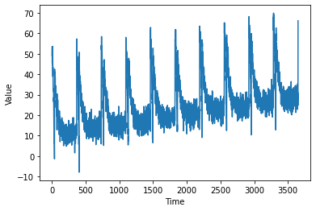
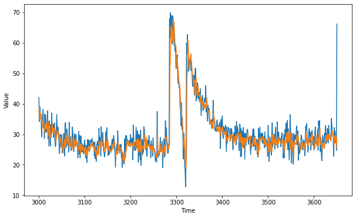

# Predicting Sequence model using DNN

This blog is to demonstrate how to use tensorflow to predict series trained on Sequence Models

You can use the [.ipnyb notebook](https://github.com/cyriacbijun/Tensorflow_NLP/blob/master/Sequence_model_DNN/Sequence_model_DNN.ipynb) that is given with the repo by downloading and starting a kernel.


*   For local computer, use [jupyter notebook](https://jupyter.org/install)
*   For cloud usage, checkout [Google colab](https://colab.research.google.com/notebooks/intro.ipynb)

```python
import tensorflow as tf
import numpy as np
import matplotlib.pyplot as plt
print(tf.__version__)
```

    2.2.0-rc3


A sequence plot may have the following properties:
* trend: *upwards or downwards shift in a data set over time*
* seasonality: *A particular repeating characteristic*
* noise: *Any form of change in data not predictable*

Using all of the above, we can create a synthetic series which depends on the time. Below functions are used to do all of the change in properties.The `plot_series` function is to plot the synthetic series.


```python
def plot_series(time, series, format="-", start=0, end=None):
    plt.plot(time[start:end], series[start:end], format)
    plt.xlabel("Time")
    plt.ylabel("Value")
    plt.grid(False)

def trend(time, slope=0):
    return slope * time

def seasonal_pattern(season_time):
    return np.where(season_time < 0.1,
                    np.cos(season_time * 6 * np.pi),
                    2 / np.exp(9 * season_time))

def seasonality(time, period, amplitude=1, phase=0):
    """Repeats the same pattern at each period"""
    season_time = ((time + phase) % period) / period
    return amplitude * seasonal_pattern(season_time)

def noise(time, noise_level=1, seed=None):
    rnd = np.random.RandomState(seed)
    return rnd.randn(len(time)) * noise_level

time = np.arange(10 * 365 + 1, dtype="float32")
baseline = 10
series = trend(time, 0.1)  
baseline = 10
amplitude = 40
slope = 0.005
noise_level = 3

# Create the series
series = baseline + trend(time, slope) + seasonality(time, period=365, amplitude=amplitude)
# Update with noise
series += noise(time, noise_level, seed=51)

split_time = 3000
time_train = time[:split_time]
x_train = series[:split_time]
time_valid = time[split_time:]
x_valid = series[split_time:]

plot_series(time, series)
```





Next, we define a windowed dataset. A window would be a small sample of the dataset, which makes the processing of the Dataset much more easier.Each window is of a particular size. The Dataset can also be shuffled and then made it batches, for easier processing.


```python
window_size = 20
batch_size = 32
shuffle_buffer_size = 1000

def windowed_dataset(series, window_size, batch_size, shuffle_buffer):
  dataset = tf.data.Dataset.from_tensor_slices(series)
  dataset = dataset.window(window_size + 1, shift=1, drop_remainder=True)
  dataset = dataset.flat_map(lambda window: window.batch(window_size + 1))
  dataset = dataset.shuffle(shuffle_buffer).map(lambda window: (window[:-1], window[-1]))
  dataset = dataset.batch(batch_size).prefetch(1)
  return dataset
```

Here, the model is having 3 layers, each of which are fully connected. The loss function used is Mean Squared Error. Stochastic gradient descent is the optimizer used with a learning rate of $10^{-6}$. The loss is really high( about 22) and there was no significant increase in performance( Its just 3 Dense Layers, can't expect much ), so it was better not to show the training epochs.


```python
dataset = windowed_dataset(x_train, window_size, batch_size, shuffle_buffer_size)


model = tf.keras.models.Sequential([
    tf.keras.layers.Dense(100, input_shape=[window_size], activation="relu"),
    tf.keras.layers.Dense(10, activation="relu"),
    tf.keras.layers.Dense(1)
])

model.compile(loss="mse", optimizer=tf.keras.optimizers.SGD(lr=1e-6, momentum=0.9))
model.fit(dataset,epochs=100,verbose=0)

```


    <tensorflow.python.keras.callbacks.History at 0x7fa094485470>


Our training data consist of entire series which is present in Dataset.The below code is used to divide the series into sizes of `window_size`. Then, we predict on that and append it into a list called forecast. Likewise, except for the initial window_size, the remaining length of the series is predicted and appended to forecast.


```python
forecast = []
for time in range(len(series) - window_size):
  forecast.append(model.predict(series[time:time + window_size][np.newaxis]))
```

We need to check performance of model. For that we separate out the validation set using `forecast[split_time-window_size:]` and then store it in result. Ploting the actual validation set with our forecasted validation set gives an overall performance rating.


```python
forecast = forecast[split_time-window_size:]
print(np.array(forecast)[:, 0, 0])
results = np.array(forecast)[:, 0, 0]
```

    [37.167503 38.904427 35.07452  37.07383  35.258263 36.580406 34.178864
     33.08709  32.634968 34.48276  35.38918  32.549335 32.488068 30.421228
     33.352783 32.013813 33.602795 31.562567 32.21329  31.051474 34.144302
     29.673878 32.40794  28.126123 33.187008 29.02722  29.15366  29.571846
     30.320719 33.296158 30.894266 31.36563  31.872526 30.017729 32.212326
     31.604511 31.167023 27.52423  28.583399 29.476744 31.365705 30.442986
     29.895557 30.853539 29.87324  28.29255  26.577372 28.46703  29.246561
     27.398357 25.81082  27.063168 25.35124  23.830278 25.905716 27.718027
     28.319107 25.123877 29.729652 30.38215  29.310263 26.517984 29.179342
     29.61902  27.442846 27.210712 25.872774 29.73518  27.228237 26.070349
     27.02691  26.043009 24.984715 25.638296 28.729383 28.712248 27.999266
     25.643442 26.903952 28.543497 27.35012  26.765036 27.995817 27.23847
     26.564316 25.537273 24.618132 25.153286 27.898428 25.225582 26.723145
     23.401987 26.681524 26.831532 26.001896 24.53083  26.168118 25.04377
     25.408106 23.853788 25.55114  25.78924  25.835005 22.875784 25.181358
     24.039986 22.870798 25.377728 24.806911 26.153381 26.082834 24.699453
     25.31933  25.917576 27.003584 26.120825 26.932951 27.309294 25.899485
     26.103632 26.312769 25.80603  24.2157   25.683601 23.562471 24.531208
     22.306849 24.445024 24.536972 26.12487  23.425892 23.976408 27.568214
     26.516006 27.596016 26.556324 24.949541 28.736368 26.270401 27.03516
     27.183912 27.727907 25.944431 25.084318 24.354187 24.137608 25.274496
     27.479607 25.788467 28.973007 25.516937 27.448086 24.583462 25.64065
     25.37081  25.105206 24.76732  24.760435 24.071365 24.698357 25.318594
     26.672697 25.231266 26.588568 26.702633 27.80788  25.800364 25.44572
     22.87396  24.519241 24.007517 24.644539 23.48307  27.262125 25.371696
     25.009882 24.11368  24.655533 25.647263 25.390848 25.411589 24.047878
     23.521713 21.420292 22.448711 22.813604 21.836721 20.90455  24.139153
     22.425432 25.623837 24.628685 27.504107 26.789726 27.716116 26.141695
     27.610062 26.590437 26.9792   26.373283 26.638256 27.007288 26.84517
     26.135357 27.082142 26.366077 24.825346 28.128414 27.2091   26.273249
     26.073503 26.021496 25.228384 28.137577 27.888433 26.367432 28.554445
     28.312937 24.07892  27.726171 25.045927 27.62551  24.146336 28.844872
     22.57624  26.04939  26.003578 25.208906 26.34078  25.185    28.68871
     30.037912 28.264685 27.895618 25.423578 28.84331  25.406942 25.645468
     26.055021 26.54522  26.277037 26.14767  26.87675  25.109522 26.035692
     24.437654 26.177359 26.133253 25.728525 24.010847 26.260105 25.00648
     24.799467 24.26495  24.517962 22.685759 23.591896 22.256897 22.272314
     29.7731   24.553127 23.695023 23.519472 24.403168 24.035263 24.48269
     26.880424 25.013905 25.975567 24.526447 25.023926 23.424864 23.919333
     24.941908 26.46226  23.23621  23.006897 29.043821 28.242138 29.243385
     27.381136 26.921392 25.964655 25.170584 26.34987  26.237347 51.621845
     55.069374 65.49097  63.232018 64.59811  61.161537 60.19817  67.53691
     66.914    66.18056  62.92691  59.290253 58.814438 58.740265 55.127403
     51.438557 54.866566 52.29638  50.813786 47.859352 46.339867 46.433414
     44.527763 41.210545 39.648357 36.642467 36.0537   32.663452 32.60478
     28.77618  25.733421 28.53198  26.037653 21.531973 20.220669 19.255484
     23.923481 47.94846  51.660854 60.688854 58.886127 52.062553 51.14525
     52.322357 53.882553 56.245594 56.342117 52.19529  50.986458 49.41027
     49.54623  46.653427 47.014336 47.870796 43.08428  45.335487 47.48348
     48.46155  43.02884  43.9025   43.607964 45.568626 44.329174 42.50805
     42.77852  43.04896  40.63621  42.516056 40.191826 39.072067 39.34681
     41.02626  40.509453 38.830414 38.396294 38.40427  39.72324  39.03507
     38.63831  41.7925   38.97786  40.185482 37.997475 36.940544 37.76936
     37.017033 37.76249  34.752403 34.08483  33.529743 33.274918 34.025932
     31.923223 34.07428  31.848131 36.629814 33.839184 35.097797 34.13767
     32.67111  32.49499  32.32381  31.494606 32.638924 32.75885  31.826439
     30.758984 31.616661 31.406427 32.615482 31.49372  29.154724 31.80262
     31.986073 31.251368 32.358673 30.59305  29.801794 30.918337 30.223083
     30.695787 29.740871 31.782097 28.843678 27.600845 28.97125  28.135778
     28.944633 29.0137   29.941593 30.063702 29.845772 27.95493  29.668219
     29.453764 30.190315 29.769901 29.433434 26.239878 26.641733 27.79259
     29.375912 27.720383 29.484554 29.291597 27.851425 30.090271 28.733206
     30.523216 30.361242 29.807735 29.665672 27.22982  30.004028 30.464056
     27.30584  28.803833 25.303638 29.022379 25.942438 27.042171 28.648064
     27.030365 28.78699  24.673388 28.673811 28.094954 27.409155 29.27218
     28.792095 30.479761 28.468859 28.310001 28.27956  28.481743 29.478989
     26.118286 26.08203  26.651323 26.357674 26.365921 26.717646 28.944767
     26.66123  29.137077 26.586403 28.096087 26.22951  26.831106 25.88599
     27.468817 24.10876  26.246454 23.197788 28.802624 24.891357 27.559587
     28.794905 28.337807 28.46382  28.575542 29.227211 28.305653 29.115997
     27.877728 27.086853 28.519667 26.17856  28.422178 26.43562  27.18511
     26.825474 26.562698 26.290186 24.165768 28.69245  27.572525 24.53476
     24.075348 26.584648 27.31284  25.42238  24.302757 26.753086 29.93977
     27.306013 26.71807  27.211016 29.183578 27.35204  26.185987 28.589031
     26.944212 27.230356 26.21936  29.232037 26.77562  27.731077 28.535072
     28.326221 27.847713 27.212915 27.262367 26.968363 27.539043 28.340714
     26.805922 27.554153 23.827564 27.910114 24.797771 26.609074 27.579643
     28.305946 30.55884  27.178062 28.431044 30.668585 27.817034 29.844229
     27.282555 26.593916 25.089388 30.92069  30.89634  27.278076 23.89788
     27.63275  27.997196 26.065071 22.221087 27.338377 26.833714 27.153315
     26.64319  27.519798 29.032913 30.214195 27.788132 29.207434 29.117428
     26.390045 26.048656 27.007578 24.884228 25.05049  24.836475 27.326393
     26.379023 27.11794  25.504412 25.659008 26.331812 26.931402 27.186403
     24.389906 26.691292 28.206366 29.041792 30.946844 26.961494 28.309889
     26.294975 27.504826 28.496185 29.33287  28.360586 28.658245 25.887579
     28.041277 28.239523 29.942541 27.507328 27.728714 27.307034 27.040272
     25.416042 27.976713 29.74171  28.525812 26.347355 26.605156 26.043196
     28.703905 26.431694 30.128052 29.778357 32.058678 28.08972  26.572046
     27.880684 27.150082 25.266993 25.522968 26.57897  27.102196 25.329575
     25.666513 27.344076 27.783335 29.865658 27.755482 29.499573 28.107533
     30.141665 29.00634  28.36756  30.040688 29.271364 29.503523 28.13729
     27.730864 28.854599 31.107597 31.337908 29.337849 29.657255 29.014212
     26.785496 29.56716  28.251036 29.806112 27.128942 29.08812  25.534979]


```python
plt.figure(figsize=(10, 6))

plot_series(time_valid, x_valid)
plot_series(time_valid, results)
```





Blue indicates validation set and orange indicates predicted validation set.

Finally, we find out the Mean Absolute Error for comapring the 3-Layer DNN with maybe better Networks like RNN.


```python
tf.keras.metrics.mean_absolute_error(x_valid, results).numpy()
```


    3.0474677
