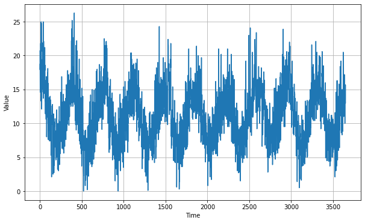
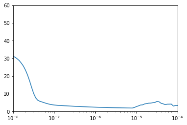
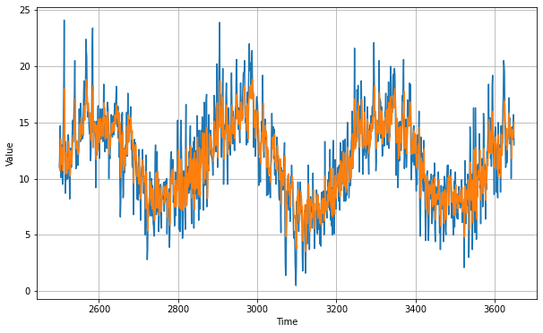

# Predicting on Real world Sunspot Dataset

This blog is to demonstrate how to use tensorflow to predict probability of occurence of sunspot

You can use the [.ipnyb notebook](https://github.com/cyriacbijun/Tensorflow_NLP/blob/master/Sunspot_Dataset/Sunspot_Dataset.ipynb) that is given with the repo by downloading and starting a kernel.


*   For local computer, use [jupyter notebook](https://jupyter.org/install)
*   For cloud usage, checkout [Google colab](https://colab.research.google.com/notebooks/intro.ipynb)

```python
import tensorflow as tf
print(tf.__version__)
```

    2.2.0-rc3


```python
import numpy as np
import matplotlib.pyplot as plt
def plot_series(time, series, format="-", start=0, end=None):
    plt.plot(time[start:end], series[start:end], format)
    plt.xlabel("Time")
    plt.ylabel("Value")
    plt.grid(True)
```

First, Downloading the data..


```python
!wget --no-check-certificate \
    https://raw.githubusercontent.com/jbrownlee/Datasets/master/daily-min-temperatures.csv \
    -O daily-min-temperatures.csv
```

    --2020-05-01 11:07:07--  https://raw.githubusercontent.com/jbrownlee/Datasets/master/daily-min-temperatures.csv
    Resolving raw.githubusercontent.com (raw.githubusercontent.com)... 151.101.0.133, 151.101.64.133, 151.101.128.133, ...
    Connecting to raw.githubusercontent.com (raw.githubusercontent.com)|151.101.0.133|:443... connected.
    HTTP request sent, awaiting response... 200 OK
    Length: 67921 (66K) [text/plain]
    Saving to: ‘daily-min-temperatures.csv’

    daily-min-temperatu 100%[===================>]  66.33K  --.-KB/s    in 0.008s  

    2020-05-01 11:07:08 (7.69 MB/s) - ‘daily-min-temperatures.csv’ saved [67921/67921]


Now that we downloaded the sunspot data, let us understand the structure of the .csv file using pandas. This step is not really necessary.


```python
import pandas as pd
data = pd.read_csv('daily-min-temperatures.csv')
data.head()
```


<div>
<style scoped>
    .dataframe tbody tr th:only-of-type {
        vertical-align: middle;
    }

    .dataframe tbody tr th {
        vertical-align: top;
    }

    .dataframe thead th {
        text-align: right;
    }
</style>
<table border="1" class="dataframe">
  <thead>
    <tr style="text-align: right;">
      <th></th>
      <th>Date</th>
      <th>Temp</th>
    </tr>
  </thead>
  <tbody>
    <tr>
      <th>0</th>
      <td>1981-01-01</td>
      <td>20.7</td>
    </tr>
    <tr>
      <th>1</th>
      <td>1981-01-02</td>
      <td>17.9</td>
    </tr>
    <tr>
      <th>2</th>
      <td>1981-01-03</td>
      <td>18.8</td>
    </tr>
    <tr>
      <th>3</th>
      <td>1981-01-04</td>
      <td>14.6</td>
    </tr>
    <tr>
      <th>4</th>
      <td>1981-01-05</td>
      <td>15.8</td>
    </tr>
  </tbody>
</table>
</div>


We do not need the first row,that's why we have `next(reader)`. In the for loop we are appending the temp values only, as float. After that we plot to see the series.


```python
import csv
time_step = []
temps = []

with open('daily-min-temperatures.csv') as csvfile:
  reader = csv.reader(csvfile, delimiter=',')
  next(reader)
  step=0
  for row in reader:
    temps.append(float(row[1]))
    time_step.append(step)
    step = step + 1

series = np.array(temps)
time = np.array(time_step)
plt.figure(figsize=(10, 6))
plot_series(time, series)
```





```python
len(temps)
```


    3650


We are splitting the train and validation data as 2500 and 1150.


```python
split_time = 2500
time_train = time[:split_time]
x_train = series[:split_time]
time_valid = time[split_time:]
x_valid = series[split_time:]

window_size = 30
batch_size = 32
shuffle_buffer_size = 1000

```

Below function `windowed_dataset` is used to create dataset usin `tf.data.Dataset` format. The `model_forecast` function is used to predict the values from the series provided. It also accepts the trained model as an arguement.


```python
def windowed_dataset(series, window_size, batch_size, shuffle_buffer):
    series = tf.expand_dims(series, axis=-1)
    ds = tf.data.Dataset.from_tensor_slices(series)
    ds = ds.window(window_size + 1, shift=1, drop_remainder=True)
    ds = ds.flat_map(lambda w: w.batch(window_size + 1))
    ds = ds.shuffle(shuffle_buffer)
    ds = ds.map(lambda w: (w[:-1], w[1:]))
    return ds.batch(batch_size).prefetch(1)
```


```python
def model_forecast(model, series, window_size):
    ds = tf.data.Dataset.from_tensor_slices(series)
    ds = ds.window(window_size, shift=1, drop_remainder=True)
    ds = ds.flat_map(lambda w: w.batch(window_size))
    ds = ds.batch(32).prefetch(1)
    forecast = model.predict(ds)
    return forecast
```

As we did in the previous blogs,after defining model structure, we are using `tf.keras.callbacks.LearningRateScheduler` to dynamically change the learning rate upon epochs. This will enable us to find the optimum learning rate.

Our model is a combination of Convolution and 2 LSTMs, both of which are bidirectional and having `return_sequences` as true. This improves the model `mae` but we have to check hoe accurate it will be after prediction and checking with validation set.


```python
tf.keras.backend.clear_session()
tf.random.set_seed(51)
np.random.seed(51)
window_size = 64
batch_size = 256
train_set = windowed_dataset(x_train, window_size, batch_size, shuffle_buffer_size)
print(train_set)
print(x_train.shape)

model = tf.keras.models.Sequential([
  tf.keras.layers.Conv1D(filters=32, kernel_size=5,
                      strides=1, padding="causal",
                      activation="relu",
                      input_shape=[None, 1]),
  tf.keras.layers.LSTM(64, return_sequences=True),
  tf.keras.layers.LSTM(64, return_sequences=True),
  tf.keras.layers.Dense(30, activation="relu"),
  tf.keras.layers.Dense(10, activation="relu"),
  tf.keras.layers.Dense(1),
  tf.keras.layers.Lambda(lambda x: x * 400)
])

lr_schedule = tf.keras.callbacks.LearningRateScheduler(
    lambda epoch: 1e-8 * 10**(epoch / 20))
optimizer = tf.keras.optimizers.SGD(lr=1e-8, momentum=0.9)
model.compile(loss=tf.keras.losses.Huber(),
              optimizer=optimizer,
              metrics=["mae"])
history = model.fit(train_set, epochs=100, callbacks=[lr_schedule])

```

    <PrefetchDataset shapes: ((None, None, 1), (None, None, 1)), types: (tf.float64, tf.float64)>
    (2500,)
    Epoch 1/100
    10/10 [==============================] - 0s 31ms/step - loss: 31.1706 - mae: 31.6550 - lr: 1.0000e-08
    Epoch 2/100
    10/10 [==============================] - 0s 23ms/step - loss: 30.5228 - mae: 31.0756 - lr: 1.1220e-08
    Epoch 3/100
    10/10 [==============================] - 0s 23ms/step - loss: 29.6681 - mae: 30.1801 - lr: 1.2589e-08
    Epoch 4/100
    10/10 [==============================] - 0s 24ms/step - loss: 28.6311 - mae: 29.0586 - lr: 1.4125e-08
    Epoch 5/100
    10/10 [==============================] - 0s 24ms/step - loss: 27.1851 - mae: 27.6945 - lr: 1.5849e-08
    Epoch 6/100
    10/10 [==============================] - 0s 24ms/step - loss: 25.5238 - mae: 25.9986 - lr: 1.7783e-08
    Epoch 7/100
    10/10 [==============================] - 0s 24ms/step - loss: 23.2871 - mae: 23.8429 - lr: 1.9953e-08
    Epoch 8/100
    10/10 [==============================] - 0s 24ms/step - loss: 20.5082 - mae: 21.1108 - lr: 2.2387e-08
    Epoch 9/100
    10/10 [==============================] - 0s 25ms/step - loss: 17.1935 - mae: 17.8091 - lr: 2.5119e-08
    Epoch 10/100
    10/10 [==============================] - 0s 23ms/step - loss: 13.4642 - mae: 14.1371 - lr: 2.8184e-08
    Epoch 11/100
    10/10 [==============================] - 0s 25ms/step - loss: 10.0364 - mae: 10.6152 - lr: 3.1623e-08
    Epoch 12/100
    10/10 [==============================] - 0s 23ms/step - loss: 7.5764 - mae: 8.1025 - lr: 3.5481e-08
    Epoch 13/100
    10/10 [==============================] - 0s 24ms/step - loss: 6.2482 - mae: 6.7711 - lr: 3.9811e-08
    Epoch 14/100
    10/10 [==============================] - 0s 24ms/step - loss: 5.6777 - mae: 6.1856 - lr: 4.4668e-08
    Epoch 90/100
    10/10 [==============================] - 0s 26ms/step - loss: 26.0024 - mae: 25.3163 - lr: 2.8184e-04
    Epoch 91/100
    10/10 [==============================] - 0s 26ms/step - loss: 39.1242 - mae: 41.0090 - lr: 3.1623e-04
    Epoch 92/100
    10/10 [==============================] - 0s 24ms/step - loss: 29.0936 - mae: 29.5980 - lr: 3.5481e-04
    Epoch 93/100
    10/10 [==============================] - 0s 24ms/step - loss: 33.0701 - mae: 32.9219 - lr: 3.9811e-04
    Epoch 94/100
    10/10 [==============================] - 0s 26ms/step - loss: 36.9112 - mae: 37.8804 - lr: 4.4668e-04
    Epoch 95/100
    10/10 [==============================] - 0s 27ms/step - loss: 41.6311 - mae: 41.2765 - lr: 5.0119e-04
    Epoch 96/100
    10/10 [==============================] - 0s 25ms/step - loss: 46.5597 - mae: 47.5416 - lr: 5.6234e-04
    Epoch 97/100
    10/10 [==============================] - 0s 24ms/step - loss: 52.5361 - mae: 52.1260 - lr: 6.3096e-04
    Epoch 98/100
    10/10 [==============================] - 0s 25ms/step - loss: 58.8236 - mae: 59.7652 - lr: 7.0795e-04
    Epoch 99/100
    10/10 [==============================] - 0s 25ms/step - loss: 66.3937 - mae: 65.8950 - lr: 7.9433e-04
    Epoch 100/100
    10/10 [==============================] - 0s 26ms/step - loss: 74.3771 - mae: 75.2363 - lr: 8.9125e-04


```python
plt.semilogx(history.history["lr"], history.history["loss"])
plt.axis([1e-8, 1e-4, 0, 60])
```


    (1e-08, 0.0001, 0.0, 60.0)





After plotting the graph we see that the loss is really low and stable for the learning_rate = $10^{-5}$. Now,we train using that learning rate.


```python
tf.keras.backend.clear_session()
tf.random.set_seed(51)
np.random.seed(51)
train_set = windowed_dataset(x_train, window_size=60, batch_size=100, shuffle_buffer=shuffle_buffer_size)
model = tf.keras.models.Sequential([
  tf.keras.layers.Conv1D(filters=60, kernel_size=5,
                      strides=1, padding="causal",
                      activation="relu",
                      input_shape=[None, 1]),
  tf.keras.layers.LSTM(60, return_sequences=True),
  tf.keras.layers.LSTM(60, return_sequences=True),
  tf.keras.layers.Dense(30, activation="relu"),
  tf.keras.layers.Dense(10, activation="relu"),
  tf.keras.layers.Dense(1),
  tf.keras.layers.Lambda(lambda x: x * 400)
])


optimizer = tf.keras.optimizers.SGD(lr=1e-5, momentum=0.9)
model.compile(loss=tf.keras.losses.Huber(),
              optimizer=optimizer,
              metrics=["mae"])
history = model.fit(train_set,epochs=150)
```

    Epoch 1/150
    25/25 [==============================] - 0s 14ms/step - loss: 9.8211 - mae: 10.4694
    Epoch 2/150
    25/25 [==============================] - 0s 13ms/step - loss: 2.5191 - mae: 2.9923
    Epoch 3/150
    25/25 [==============================] - 0s 13ms/step - loss: 1.9513 - mae: 2.4047
    Epoch 4/150
    25/25 [==============================] - 0s 13ms/step - loss: 1.8610 - mae: 2.3151
    Epoch 5/150
    25/25 [==============================] - 0s 13ms/step - loss: 1.8209 - mae: 2.2733
    Epoch 6/150
    25/25 [==============================] - 0s 13ms/step - loss: 1.7905 - mae: 2.2418
    Epoch 7/150
    25/25 [==============================] - 0s 14ms/step - loss: 1.7667 - mae: 2.2186
    Epoch 8/150
    25/25 [==============================] - 0s 13ms/step - loss: 1.7387 - mae: 2.1906
    Epoch 9/150
    25/25 [==============================] - 0s 13ms/step - loss: 1.7173 - mae: 2.1681
    Epoch 10/150
    25/25 [==============================] - 0s 13ms/step - loss: 1.6987 - mae: 2.1482
    Epoch 11/150
    25/25 [==============================] - 0s 13ms/step - loss: 1.6815 - mae: 2.1287
    Epoch 12/150
    25/25 [==============================] - 0s 14ms/step - loss: 1.6685 - mae: 2.1159
    Epoch 13/150
    25/25 [==============================] - 0s 14ms/step - loss: 1.6576 - mae: 2.1030
    Epoch 14/150
    25/25 [==============================] - 0s 14ms/step - loss: 1.6430 - mae: 2.0891
    Epoch 136/150
    25/25 [==============================] - 0s 13ms/step - loss: 1.4917 - mae: 1.9333
    Epoch 137/150
    25/25 [==============================] - 0s 13ms/step - loss: 1.4946 - mae: 1.9363
    Epoch 138/150
    25/25 [==============================] - 0s 13ms/step - loss: 1.4904 - mae: 1.9329
    Epoch 139/150
    25/25 [==============================] - 0s 13ms/step - loss: 1.4885 - mae: 1.9321
    Epoch 140/150
    25/25 [==============================] - 0s 13ms/step - loss: 1.4897 - mae: 1.9325
    Epoch 141/150
    25/25 [==============================] - 0s 13ms/step - loss: 1.4902 - mae: 1.9311
    Epoch 142/150
    25/25 [==============================] - 0s 13ms/step - loss: 1.4900 - mae: 1.9304
    Epoch 143/150
    25/25 [==============================] - 0s 13ms/step - loss: 1.4916 - mae: 1.9333
    Epoch 144/150
    25/25 [==============================] - 0s 14ms/step - loss: 1.4909 - mae: 1.9326
    Epoch 145/150
    25/25 [==============================] - 0s 13ms/step - loss: 1.4887 - mae: 1.9299
    Epoch 146/150
    25/25 [==============================] - 0s 13ms/step - loss: 1.4943 - mae: 1.9364
    Epoch 147/150
    25/25 [==============================] - 0s 13ms/step - loss: 1.4889 - mae: 1.9306
    Epoch 148/150
    25/25 [==============================] - 0s 14ms/step - loss: 1.4882 - mae: 1.9300
    Epoch 149/150
    25/25 [==============================] - 0s 16ms/step - loss: 1.4900 - mae: 1.9307
    Epoch 150/150
    25/25 [==============================] - 0s 13ms/step - loss: 1.4886 - mae: 1.9292


```python
rnn_forecast = model_forecast(model, series[..., np.newaxis], window_size)
rnn_forecast = rnn_forecast[split_time - window_size:-1, -1, 0]
```

We are removing the series data at time before split_time - window_size and then taking the data all the way to the end. After that, we plot to see the validation vs prediction.


```python
plt.figure(figsize=(10, 6))
plot_series(time_valid, x_valid)
plot_series(time_valid, rnn_forecast)
```





```python
tf.keras.metrics.mean_absolute_error(x_valid, rnn_forecast).numpy()
```


    1.7796258


The mean absolute error is really low compared to the other models we have tried out before. The next statement simply prints the forecasted values.


```python
print(rnn_forecast)
```

    [11.329356 10.705612 12.124963 ... 13.604561 13.796917 15.009445]
